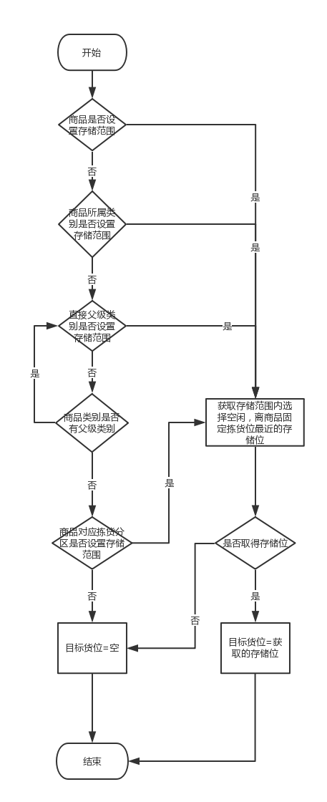
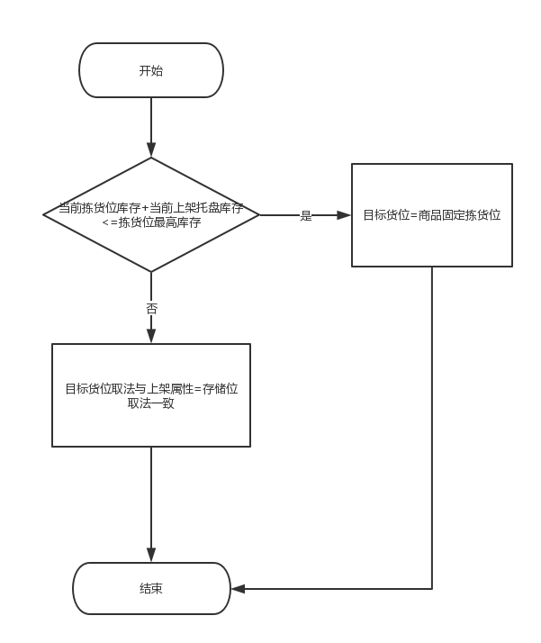

## 上架算法

> 收货完成后根据收货单明细生成上架指令时，计算目标货位

### 基础准备

#### 商品模块
> 增加 上架属性：存储位、拣货位、优先拣货位，默认优先拣货位。

#### 拣货方案模块
> 包含：商品、 拣货分区、固定拣货位、最低库存、最高库存、存储区域

#### 系统配置模块
> 增加存储区域配置
> 增加存储区域与拣货分区配置（一对多）
> 增加存储区域与商品类别配置（一对多）

### 计算上架货位

#### 上架属性=存储位
##### 1、根据上架商品查找存储范围。
> 优先级：商品存储区域->商品类别存储区域>拣货分区存储区域。
> 商品类别存储区域查询规则：首先找商品直接父级商品类别对应存储区域，没有配置则继续查商品类别的直接父级，直到找到对应的存储区域或到顶级。
##### 2、获取到存储范围
> 在存储范围内，找一个空闲的、距离商品拣货位最近的一个存储位作为建议上架货位；若没有空闲存储位，建议上架货位=空。
##### 3、获取不到存储范围
> 建议上架货位=空

#### 上架属性=拣货位
> 建议上架货位=商品固定拣货位

#### 上架属性=优先拣货位
1. 根据上架商品取拣货方案的最高库存。
2. 当前拣货位上架商品库存+当前上架托盘中上架商品库存<=拣货方案最高库存，建议上架货位=商品固定拣货位
3. 当前拣货位上架商品库存+当前上架托盘中上架商品库存>拣货方案最高库存，建议上架货位获取算法同上架属性=存储位。

###  流程图
###### 上架属性=拣货位业务简单清晰，无需流程图。

##### 上架属性=存储位

##### 上架属性=优先拣货位

