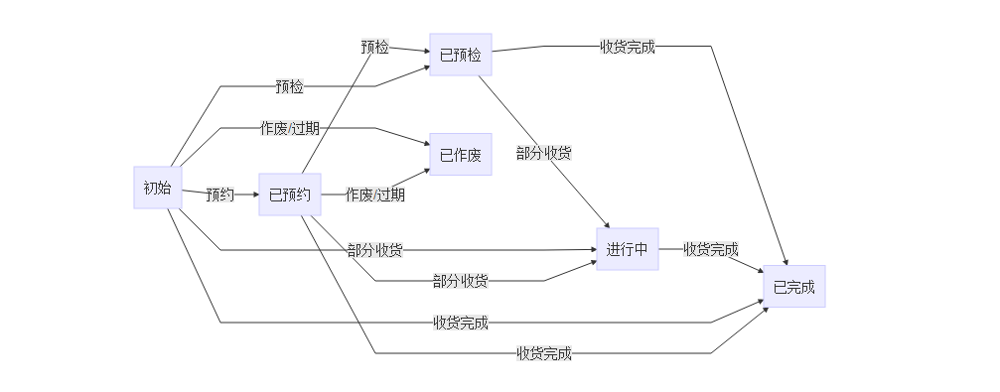

## 入库订单

> 商品采购凭证，告诉供应商需要哪些商品、数量、规格以及单价。作为收货的依据。

### 表结构

#### 订单

列名 | 类型 | 是否为空 | 备注
---|---|---|---
UUID | VARCHAR(32) | NOT NULL | 主键UUID
BILLNUMBER | VARCHAR(30) | NOT NULL | 单号
SOURCEBILLNUMBER | VARCHAR(30) | NOT NULL | 来源单号
BILLTYPE | VARCHAR(30) | NOT NULL | 单据类型，淘宝订单...
SUPPLIERUUID | VARCHAR(32) | NOT NULL | 供应商UUID
WRHUUID | VARCHAR(32) | NOT NULL |  仓位UUID
EXPIREDATE | DATE | NULL | 到效日期，超期则作废
BOOKDATE | DATE | NULL | 供应商预计送货时间，预约时录入
STATE | VARCHAR(30) | NOT NULL | 订单状态
COMPANYUUID | VARCHAR(32) | NOT NULL | 组织UUID
TOTALCASEQTYSTR | VARCHAR(30) | NOT NULL | 订单中明细商品总件数
RECEIVECASEQTYSTR | VARCHAR(30) | NOT NULL | 订单已收货的总件数
NOTE | VARCHAR(255) | NULL | 备注
CREATEDID | VARCHAR(32) | NOT NULL | 订单创建人
CREATEDCODE | VARCHAR(30) | NOT NULL | 订单创建人代码
CREATEDNAME | VARCHAR(100) | NOT NULL | 创建人名称
CREATEDTIME | DATETIME | NOT NULL | 创建时间
LASTMODIFYID | VARCHAR(32) | NOT NULL | 最后修改人ID
LASTMODIFYCODE | VARCHAR(30) | NOT NULL | 最后修改人代码
LASTMODIFYNAME | VARCHAR(100) | NOT NULL | 最后修改人名称
LASTMODIFYTIME | DATETIME | NOT NULL | 最后修改时间
VERSION | INT | NOT NULL | 版本号，初始为0，每修改一次增加1

#### 明细

列名 | 类型 | 是否为空 | 备注
---|---|---|---
UUID | VARCHAR(32) | NOT NULL | 明细UUID，主键
ORDERBILLUUID | VARCHAR(32) | NOT NULL | 订单UUID
LINE | INT | NOT NULL | 行号
ARTICLEUUID | VARCHAR(32) | NOT NULL | 商品UUID
QPCSTR | VARCHAR(30) | NOT NULL | 商品规格，以此规格进行收货
QTY | DECIMAL(12,3) | NOT NULL | 数量
CASEQTYSTR | VARCHAR(30) | NOT NULL | 订货件数
RECEIVEQTY | DECIMAL(12,3) | NOT NULL | 已收货数量
RECEIVECASEQTYSTR | VARCHAR(30) | NOT NULL | 已收货件数
PRICE | DECIMAL(12,3) | NOT NULL | 单价，可用于报表

### 状态流

- 初始：新创建的订单状态为初始。
- 已预约：配送和供应商约好到货日期的时候，状态为已预约
- 已预检：供应商把货送到时，修改订单状态为已预检
- 进行中：已预检的订单开始收货，但是不是一次性收完的，状态改为进行中
- 已完成：进行中的收货完成或者初始的一次收货完成，状态变为已完成
- 已作废：订单过期或者取消订单时，作废订单

### 业务说明

1. 初始、已预约、已预检的订单和进行中的订单才能收货。
2. 可APP收货也可WEB收货，一个订单明细可多次收货。
3. 收货数量不能大于订单明细数量。
4. 所有明细全部收货完成后，订单自动完成，也可手工完成。
