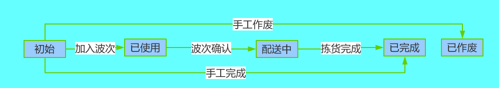

## 配货通知单

> 用于刻画门店/客户要货需求

只有仓库管理员能查看、操作配货通知单模块。

#### 字段定义

###### 配货通知单

列名 | 数据类型 | 是否为空 | 说明
---|--- | --- | ---
UUID | VARCHAR(32) | NOT NULL | 主键UUID，系统生成
BILLNUMBER | VARCHAR(30) | NOT NULL | 单号，系统生成
STATE | VARCHAR(100) | NOT NULL | 状态，默认初始
DELIVERYREASON| VARCHAR(100) | NOT NULL | 配货原因，默认正常
DELIVERYSYSTEM| VARCHAR(100) | NOT NULL | 配货体系，默认传统
DELIVERYMODE| VARCHAR(100) | NOT NULL | 配货方式
SOURCEBILLNUMBER | VARCHAR(30) | NOT NULL | 来源单号，用户输入
SOURCEBILLTYPE | VARCHAR(100) | NOT NULL | 来源单号类型，用户输入
WRHUUID | VARCHAR(32) | NOT NULL | 仓位UUID，用户输入
COMPANYUUID | VARCHAR(32) | NOT NULL | 组织ID 取创建人所属组织
REMARk | VARCHAR(255) | NULL | 备注，对配货通知单的说明信息
VERSION | INT | NOT NULL | 版本号
CUSTOMERUUID | VARCHAR(32) | NOT NULL | 客户UUID，用户输入
CUSTOMERCODE | VARCHAR(30) | NOT NULL | 客户CODE，用户输入
CUSTOMERNAME | VARCHAR(30) | NOT NULL | 客户NAME，用户输入
TASKBILLNUMBER | VARCHAR(30) | NOT NULL | 作业号
CREATEDID | VARCHAR(32)| NOT NULL | 创建人ID
CREATEDCODE | VARCHAR(30)| NOT NULL | 创建人CODE
CREATEDNAME | VARCHAR(100)| NOT NULL | 创建人NAME
LASTMODIFYID | VARCHAR(32)| NOT NULL | 最后修改人ID
LASTMODIFYCODE | VARCHAR(30)| NOT NULL | 最后修改人CODE
LASTMODIFYNAME | VARCHAR(100)| NOT NULL | 最后修改人NAME
CREATEDTIME | DATE| NOT NULL | 创建时间
LASTMODIFYTIME | DATE| NOT NULL | 最后修改时间

###### 配货通知单明细

列名 | 数据类型 | 是否为空 | 说明
---|--- | --- | ---
UUID | VARCHAR(32) | NOT NULL | 主键UUID，系统生成
ALCNTCBILLUUID | VARCHAR(32) | NOT NULL | 配货通知单uuid
LINE | INT | NOT NULL | 行号
ARTICLEUUID | VARCHAR(32) | NOT NULL | 商品UUID，用户输入
QPCSTR | VARCHAR(30) | NOT NULL | 商品包装规格，用户输入
MUNIT | VARCHAR(30) | NOT NULL | 商品包装单位，用户输入
QTY | DECIMAL(12,3) | NOT NULL | 要货数量，用户输入
CASEQTYSTR | VARCHAR(30) | NOT NULL | 要货件数，用户输入
PLANQTY | DECIMAL(12,3) |  NULL | 计划数量
PLANCASEQTYSTR | VARCHAR(30) |  NULL | 计划件数
REALQTY | DECIMAL(12,3) |  NULL | 实际数量
REALCASEQTYSTR | VARCHAR(30) |  NULL | 实际件数
PRICE | DECIMAL(12,3) | NOT NULL | 单价，用户输入
AMOUNT | DECIMAL(12,3) | NOT NULL | 金额，用户输入
REMARk | VARCHAR(255) | NULL | 备注，对配货通知单明细的说明信息

#### 状态流

- 初始：新建保存或接收ERP数据生成的状态；
- 已作废：初始状态支持作废，作废后单据状态变成已作废；
- 待配送：加入波次任务，任务未确认之前的状态；
- 分拣中：加入波次任务，任务确认之后到拣货指令；
- 已完成：配货通知单对应拣货指令全部结束；
- 配送中：配货通知单对应拣货指令均装车或者部分装车，此时状态=配送中；
- 已交接：配送司机与门店/客户交接确认后，状态=已交接；
	

#### 字段说明
- 作业号：  对应的波次单号；
- 配送原因：默认=正常配货，支持用户录入自定义原因；
- 配送体系：传统体系、电商体系，默认传统体系；
- 配送方式：由配送体系决定，传统体系下默认仓库配送，电商体系下可选顺丰、圆通等快递或物流公司；
- 数量：    客户要货数；
- 计划数量：  加入波次后生成计划配货数量；
- 实际数量：  实际拣货的数量；

#### 业务说明
- 初始状态的配单可编辑、删除、作废、完成。

