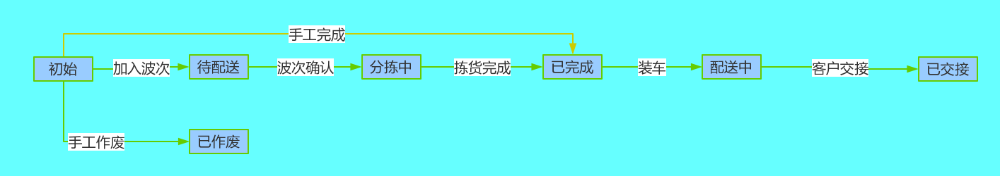

## 配货通知单

> 用于刻画门店/客户要货需求

只有仓库管理员能查看、操作配货通知单模块。

#### 字段定义

###### 配货通知单

列名 | 数据类型 | 是否为空 | 说明
---|--- | --- | ---
UUID | VARCHAR(32) | NOT NULL | 主键UUID，系统生成
BILLNUMBER | VARCHAR(30) | NOT NULL | 单号，系统生成
STATE | VARCHAR(100) | NOT NULL | 状态，默认正常
SOURCEBILLNUMBER | VARCHAR(30) | NOT NULL | 来源单号，用户输入
SOURCEBILLTYPE | VARCHAR(100) | NOT NULL | 来源单号类型，用户输入
WRHUUID | VARCHAR(32) | NOT NULL | 仓位UUID，用户输入
COMPANYUUID | VARCHAR(32) | NOT NULL | 组织ID 取创建人所属组织
REMARk | VARCHAR(255) | NULL | 备注，对配货通知单的说明信息
VERSION | INT | NOT NULL | 版本号
CUSTOMERUUID | VARCHAR(32) | NOT NULL | 送货对象UUID，用户输入
DELIVERYTIME | DATE| NOT NULL | 配货时间
TASKBILLNUMBER | VARCHAR(30) | NOT NULL | 作业号
CREATEDID | VARCHAR(32)| NOT NULL | 创建人ID
CREATEDCODE | VARCHAR(30)| NOT NULL | 创建人CODE
CREATEDNAME | VARCHAR(100)| NOT NULL | 创建人NAME
LASTMODIFYID | VARCHAR(32)| NOT NULL | 最后修改人ID
LASTMODIFYCODE | VARCHAR(30)| NOT NULL | 最后修改人CODE
LASTMODIFYNAME | VARCHAR(100)| NOT NULL | 最后修改人NAME
CREATEDTIME | DATE| NOT NULL | 创建时间
LASTMODIFYTIME | DATE| NOT NULL | 最后修改时间

###### 配货通知单明细

列名 | 数据类型 | 是否为空 | 说明
---|--- | --- | ---
UUID | VARCHAR(32) | NOT NULL | 主键UUID，系统生成
ALCNTCBILLUUID | VARCHAR(32) | NOT NULL | 配货通知单uuid
LINE | INT | NOT NULL | 行号
ARTICLEUUID | VARCHAR(32) | NOT NULL | 商品UUID，用户输入
QPCSTR | VARCHAR(30) | NOT NULL | 商品包装规格，用户输入
MUNIT | VARCHAR(30) | NOT NULL | 商品包装单位，用户输入
QTY | DECIMAL(12,3) | NOT NULL | 要货数量，用户输入
CASEQTYSTR | VARCHAR(30) | NOT NULL | 要货件数，用户输入
PLANQTY | DECIMAL(12,3) |  NULL | 计划数量
PLANCASEQTYSTR | VARCHAR(30) |  NULL | 计划件数
REALQTY | DECIMAL(12,3) |  NULL | 实际数量
REALCASEQTYSTR | VARCHAR(30) |  NULL | 实际件数
PRICE | DECIMAL(12,3) | NOT NULL | 单价，用户输入
AMOUNT | DECIMAL(12,3) | NOT NULL | 金额，用户输入
REMARk | VARCHAR(255) | NULL | 备注，对配货通知单明细的说明信息

#### 状态流



```
graph LR
A[初始]-->|加入波次|B[已使用]
B-->|波次确认|C[配货中]
C-->|拣货完成|D[已完成]
A-->|作废|E[已作废]
A-->|完成|D
```
- 初始：新建保存或接收ERP数据生成的状态；
- 已使用：加入波次，未确认之前的状态；
- 已作废：初始状态支持作废，作废后单据状态变成已作废；
- 配货中：波次确认后到拣货指令完成；
- 已完成：配货通知单对应拣货指令结束或初始状态手工完成；
	

#### 业务说明
数量    客户要货数量
计划数量  加入波次后生成计划配货数量
实际数量  实际拣货的数量
作业号  对应的波次单号


