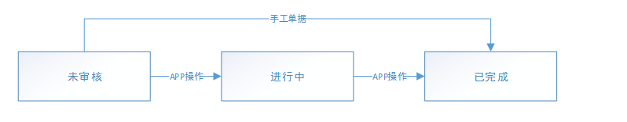

### 退仓单

> 刻画客户退货到仓库，仓库的收货过程。

#### 状态流、

#### 表结构

字段名 | 类型 | 是否为空 | 备注
---|---|---|---
UUID | VARCHAR(32) | NOT NULL | 主键
BILLNUMBER | VARCHAR（30）| NOT NULL | 单号
STATE | VARCHAR(30) | NOT NULL | 状态
RETURNNTCBILLNUMBER | VARCHAR(30) | NOT NULL | 退仓通知单号
WRHUUID | VARCHAR(32) | NOT NULL | 仓位UUID
COMPANYUUID | VARCHAR(30) | NOT NULL | 组织ID
CUSTOMERUUID | VARCHAR(32) | NOT NULL | 客户UUID
CUSTOMERCODE | VARCHAR(30) | NOT NULL | 客户code
CUSTOMERNAME | VARCHAR(100) | NOT NULL | 客户名称
RETURNORUUID | VARCHAR(32) | NOT NULL | 退仓员UUID
RETURNORCODE | VARCHAR(30) | NOT NULL | 退仓员代码
RETURNORNAME | VARCHAR(100) | NOT NULL | 退仓员名称
TOTALCASEQTYSTR | VARCHAR(30) | NOT NULL | 退仓总件数
TOTALAMOUNT | DECIMAL(12,3) | NOT NULL | 退仓总金额
REMARK | VARCHAR(255) | NULL | 备注
CREATEDID | VARCHAR(32) | NOT NULL | 创建人
CREATEDCODE | VARCHAR(30) | NOT NULL | 创建人代码
CREATEDNAME | VARCHAR(100) | NOT NULL | 创建人名称
CREATEDTIME | DATETIME | NOT NULL | 创建时间
LASTMODIFYID | VARCHAR(32) | NOT NULL | 最后修改人ID
LASTMODIFYCODE | VARCHAR(30) | NOT NULL | 最后修改人代码
LASTMODIFYNAME | VARCHAR(100) | NOT NULL | 最后修改人名称
LASTMODIFYTIME | DATETIME | NOT NULL | 最后修改时间
VERSION | INT | NOT NULL | 版本号，初始为0，每修改一次增加1

#### 明细

字段名 | 类型 | 是否为空 | 备注
---|---|---|---
UUID | VARCHAR(32) | NOT NULL | 主键
RETURNBILLUUID  | VARCHAR(32) | NOT NULL | 退仓单UUID
RETURNNTCBILLITEMUUID | VARCHAR(32) | NOT NULL | 退仓通知单明细UUID
LINE | INT | NOT NULL | 行号
ARTICLEUUID | VARCHAR(32) | NOT NULL | 商品UUID
MUNIT | VARCHAR(30) | NOT NULL | 计量单位
QPCSTR | VARCHAR(30) | NOT NULL | 规格
SUPPLIERUUID | VARCHAR(32) | NOT NULL | 供应商UUID
QTY | DECIMAL(12，3)| NOT NULL | 数量
CASEQTYSTR | VARCHAR(30) | NOT NULL | 件数
RETURNTYPE | VARCHAR(30) | NOT NULL | 退仓类型
PRODUCTIONDATE | DATE | NOT NULL | 生产日期
VALIDDATE | DATE | NOT NULL | 到效期
STOCKBATCH | VARCHAR(30) | NOT NULL | 批次
PRICE | DECIMAL(12，3)| NOT NULL | 退仓价格
AMOUNT | DECIMAL(12，3)| NOT NULL | 退仓金额

#### 备注

1. 退仓单是针对退仓通知单进行收货，所以退仓单数量之和不能大于对应的退仓通知单数量。
2. 退仓单审核后，需回写对应的退仓通知单明细数量和通知单状态。
3. 退仓单审核后需根据退仓收货的容器生成退仓上架指令。此时库存在退仓收货暂存位上。 
4. 退仓单审核后，如果对应的退仓通知单所有明细全部收货完成，则退仓通知单状态变为已完成，否则状态为进行中。
5. 好退类型的商品和退供应商的商品不能混载
6. 好退类型的商品可以在容器上任意混载，包括混供应商、混商品，审核后生成的上架指令的目标货位按照收货上架逻辑查
7. 退供应商类型的退仓收货，同一托盘只可混商品不能混供应商，上架的目标货位为供应商退货位，算法参照退仓上架算法。
8. 新建和编辑界面提供批量修改生产日期、退仓类型、目标容器的功能。
9. 每条明细生成一条退仓上架指令，同一容器下的指令，指令租id相同，用于APP上架操作。