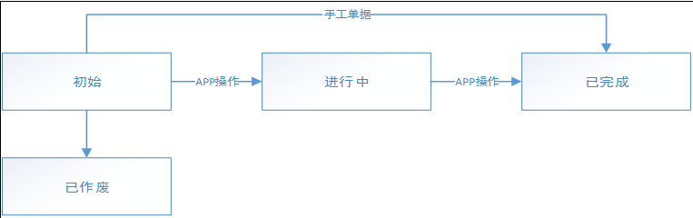

### 退仓通知单

> 描述客户退货到仓库的单据，退货的数量和退货的价格、

#### 状态流

#### 表结构

字段名 | 类型 | 是否为空 | 备注
---|---|---|---
UUID | VARCHAR(32) | NOT NULL | 主键
BILLNUMBER | VARCHAR（30）| NOT NULL | 单号
STATE | VARCHAR(30) | NOT NULL | 状态
SOURCEBILLTYPE | VARCHAR(100) | NULL | 来源单据类型，淘宝类
SOURCEBILLNUMBER | VARCHAR(100) | NULL | 来源单据单号
WRHUUID | VARCHAR(32) | NOT NULL | 仓位UUID
COMPANYUUID | VARCHAR(30) | NOT NULL | 组织ID
CUSTOMERUUID | VARCHAR(32) | NOT NULL | 客户UUID
CUSTOMERCODE | VARCHAR(30) | NOT NULL | 客户code
CUSTOMERNAME | VARCHAR(100) | NOT NULL | 客户名称
RETURNDATE | DATE | NOT NULL | 退货日期
TOTALCASEQTYSTR | VARCHAR(30) | NOT NULL | 退仓总件数
TOTALRETURNEDCASEQTYSTR | VARCHAR(30) | NOT NULL | 已退总件数
TOTALAMOUNT | DECIMAL(12,3) | NOT NULL | 退仓总金额
TOTALRETURNEDAMOUNT | DECIMAL(12,3) | NOT NULL | 已退总金额
REMARK | VARCHAR(255) | NULL | 备注
CREATEDID | VARCHAR(32) | NOT NULL | 创建人
CREATEDCODE | VARCHAR(30) | NOT NULL | 创建人代码
CREATEDNAME | VARCHAR(100) | NOT NULL | 创建人名称
CREATEDTIME | DATETIME | NOT NULL | 创建时间
LASTMODIFYID | VARCHAR(32) | NOT NULL | 最后修改人ID
LASTMODIFYCODE | VARCHAR(30) | NOT NULL | 最后修改人代码
LASTMODIFYNAME | VARCHAR(100) | NOT NULL | 最后修改人名称
LASTMODIFYTIME | DATETIME | NOT NULL | 最后修改时间
VERSION | INT | NOT NULL | 版本号，初始为0，每修改一次增加1

#### 明细

字段名 | 类型 | 是否为空 | 备注
---|---|---|---
UUID | VARCHAR(32) | NOT NULL | 主键
RETURNNTCBILLUUID  | VARCHAR(32) | NOT NULL | 退仓通知单UUID
LINE | INT | NOT NULL | 行号
ARTICLEUUID | VARCHAR(32) | NOT NULL | 商品UUID
MUNIT | VARCHAR(30) | NOT NULL | 计量单位
QPCSTR | VARCHAR(30) | NOT NULL | 规格
SUPPLIERUUID | VARCHAR(32) | NOT NULL | 供应商UUID
QTY | DECIMAL(12，3)| NOT NULL | 数量
CASEQTYSTR | VARCHAR(30) | NOT NULL | 件数
REALQTY | DECIMAL(12，3)| NOT NULL | 已退数量
REALCASEQTYSTR | VARCHAR(30) | NOT NULL | 已退件数
REASON | VARCHAR(30) | NULL | 退仓原因
PRICE | DECIMAL(12，3)| NOT NULL | 退仓价格
AMOUNT | DECIMAL(12，3)| NOT NULL | 退仓金额

#### 备注

1. 作废：初始的单据可以作废，也可以删除，有业务意义的可以作废，无意义的可直接删除，由用户自行决定。
2. 完成：初始和进行中的都可以完成，完成后就不能再进行退仓收货。
3. 生成退仓单：按照指定的退仓通知单生成退仓单，退仓单明细即通知单所有明细，退仓类型为退供应商，容器为虚拟容器，该单据在审核时如果容器依然是虚拟容器则报错，提示用户修改容器。