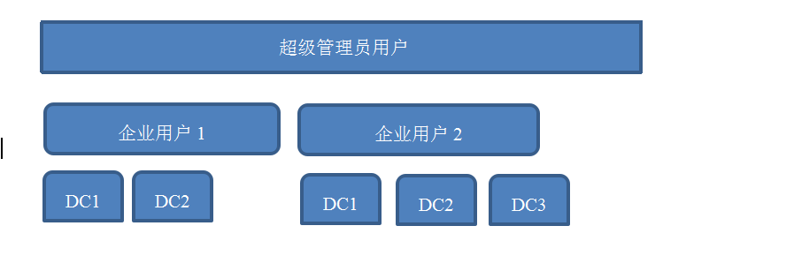
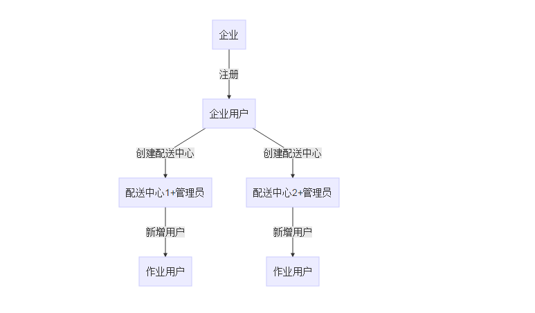

### 注册

##### 系统架构图

##### 用户类型

1. 超级管理员用户：监控整个系统，系统预留，不能注册和新建
2. 企业用户：查看当前企业下的所有配送中心的进销存情况
3. 管理员用户：管理具体一个配送中心，可进行权限分配
4. 普通用户：仓库作业用户，作业的权限由管理员用户进行分配

##### Sardine注册流程

注册的企业作为一个用户，存在用户ID，企业下的配送中心通过企业的用户ID进行关联。

基本资料：客户、供应商、商品类别、商品等由企业用户统一管理，且该企业用户下的配送中心可共用，针对某个具体配送中心可新建基本资料，新建后的基本资料其他配送也可以使用，但是都不能删除，只有企业管理员可删除和修改。

企业用户在创建配送中心时，系统会提示输入一个配送中心管理员的账号，根据该账号系统会创建一个针对该配送中心的管理员用户。
